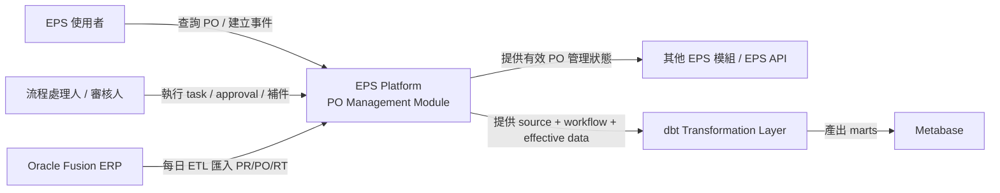
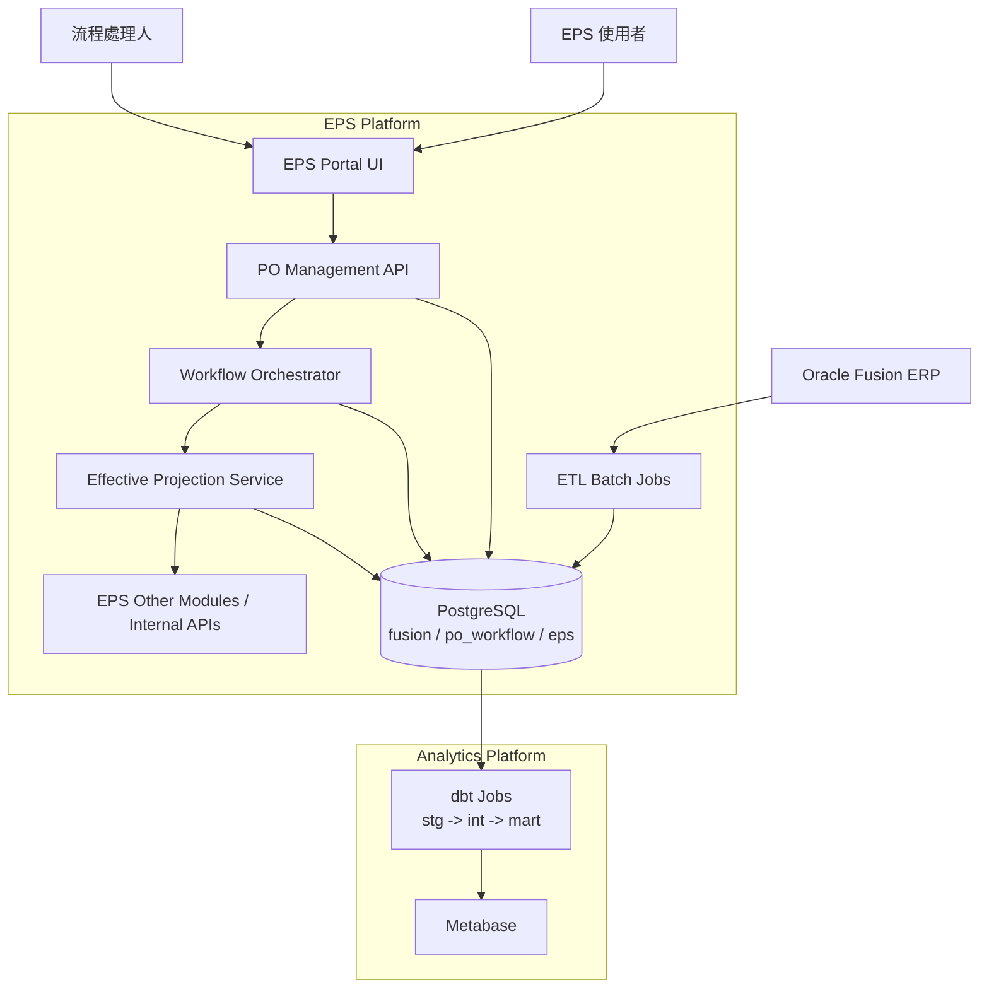
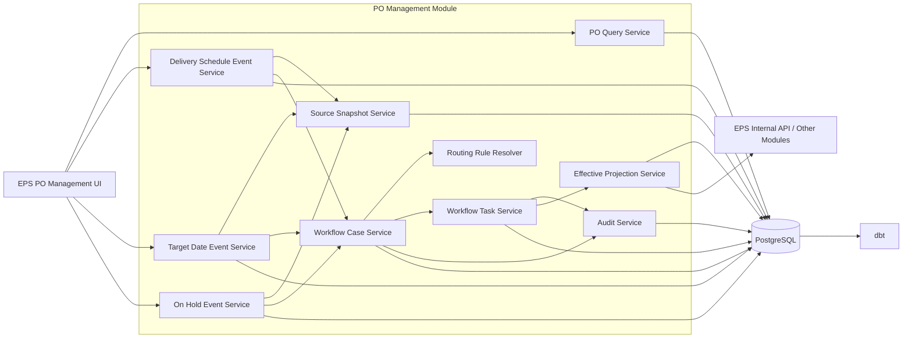

# EPS PO Management Module Specification

## 1. 文件目的

本文件定義 EPS 系統內部的 PO Management 模組規格，用於管理 PO Line 層級的交期設定、Target Date 設定、On Hold 設定、工作流程、審計追蹤，以及後續資料發布與分析建模。

本文件已依下列三個關鍵修正重新整理：

- PO Management 不是獨立系統，而是 EPS 平台中的一個模組。
- Workflow 不只包含簽核，也包含設定、補件、提供資訊、確認、系統動作等任務節點。
- 業務資料不能只靠單一 generic change request 承載，必須採用 feature-specific event tables 搭配共用 workflow orchestration。

本規格採用以下原則：

- Oracle Fusion ERP 為上游交易來源系統。
- EPS 為營運系統與模組承載平台。
- PostgreSQL 為 EPS 平台的整合資料庫，使用多 schema 分層管理。
- PO Management 模組不直接回寫 Oracle Fusion。
- dbt 負責資料模型轉換，Metabase 負責報表與分析展示。
- 文件本身不依賴任何既有程式架構或實作細節。

## 2. 模組定位

### 2.1 EPS 內部定位

PO Management 是 EPS 平台中的一個領域模組，不是獨立產品。它負責：

- 查詢 Oracle Fusion 落地後的 PO/PR/RT 資料
- 對 PO Line 發起營運性事件
- 管理事件在 EPS 內部的 workflow
- 將生效後的資料投影為 EPS 可消費的有效狀態
- 將歷史資料提供給 dbt 與 Metabase

### 2.2 與 EPS 其他能力的關係

- PO Management UI 是 EPS Portal 中的一個功能頁面或功能群。
- Workflow Engine 是 EPS 共享能力，但 PO Management 可以定義自己的 workflow rules 與 task types。
- eps schema 是 EPS 平台的 operational serving schema，不是外部 downstream system。
- 其他 EPS 模組或 API 若需要已核准的 PO 管理結果，應從 eps schema 或對應 read model 讀取，而不是直接讀 po_workflow 原始表。

## 3. 目標與非目標

### 3.1 目標

- 提供 PO Line 層級的 ETD + QTY 交期設定能力。
- 提供 PO Line 層級的 Target Date 設定能力。
- 提供 PO Line 層級的 On Hold 數量與原因設定能力。
- 將上述事件納入可配置的 workflow，workflow 可包含簽核、資訊補件、設定動作、確認與系統步驟。
- 保留完整 Audit Trail，支援未來審核人員、處理人員或群組動態調整。
- 提供與 Oracle Fusion、EPS 內部 serving layer、dbt、Metabase 的清楚邊界。
- 支援未來 GAP 分析，能同時比對事件提交當下快照與最新 Fusion 狀態。

### 3.2 非目標

- 不在此模組中編輯 PR 資料。
- 不在此模組中編輯 RT 資料。
- 不直接回寫 Oracle Fusion。
- 不在此規格中定義 dbt SQL 實作細節。
- 不在此規格中綁定任何特定前端或後端框架。

## 4. 範圍與邊界

### 4.1 業務範圍

本模組的主體是 PO Line。PR、PO、RT 等資料會由 Oracle Fusion 每日 ETL 落地到 PostgreSQL 的 fusion schema，作為查詢、對照與分析基礎資料。

可編輯的業務事件限於以下三種：

- 交期事件：維護 ETD 與對應 QTY 的拆分結果
- Target Date 事件：維護目標日期與對應 quantity range
- On Hold 事件：維護 PO Line 的 on hold 數量與原因

上述三種事件都可以進入 workflow。workflow 的每一關不限定為簽核，也可能是：

- 指定角色補齊資料
- 指定人員設定 ETD
- 指定部門提供原因或說明
- 採購或管理者審核
- 系統執行發布或通知

### 4.2 系統邊界

- Oracle Fusion ERP：上游資料來源，只讀。
- EPS Platform：承載 PO Management 模組、Workflow Engine、EPS operational serving layer。
- dbt：由 fusion、po_workflow、eps 建立 stg、int、mart 與 star schema。
- Metabase：查詢 mart 層資料。

## 5. 關鍵業務規則

### 5.1 交期設定規則

- 一個 PO Line 可拆分多筆交期。
- 每筆交期維護 ETD 與 QTY。
- 多筆交期允許相同 ETD。
- 多筆交期允許相同數量。
- 數量允許小數。
- 交期拆分後的數量總和必須等於 PO Line quantity。
- 顯示與排序依 split_seq，不依 ETD 日期排序。
- 交期事件可包含多個 workflow steps，只有 workflow 完成且資料生效後才會更新 EPS effective state。

### 5.2 Target Date 設定規則

- 一個 PO Line 可拆分多筆 Target Date。
- 多筆 Target Date 允許相同日期。
- 多筆 Target Date 允許相同數量。
- 數量允許小數。
- 每筆 Target Date 必須對應精準 quantity range。
- quantity range 不可重疊，但允許留空。
- 區間採半開區間表示法 [range_from_qty, range_to_qty)。
- Target Date 事件需保留提交當下的來源快照，以支援未來 GAP 分析。

### 5.3 On Hold 設定規則

- 一個 PO Line 在目前範圍內只維護一筆有效 On Hold 設定。
- On Hold 事件至少需維護 on_hold_qty 與 reason。
- On Hold 目前以 aggregate quantity 表達，不先追蹤來源單據 allocation。
- On Hold 資料需走 workflow 後才生效。

### 5.4 流程與治理規則

- 流程粒度為每個 PO Line、每個事件類型各自一個 business event。
- workflow steps 可以是 approval step，也可以是 task step。
- 所有主鍵使用 bigint identity。
- 所有 quantity 欄位使用 numeric，支援小數。
- 所有關鍵操作必須寫入 append-only audit 紀錄。
- workflow 路由需支援由指定人員改為指定群組，且不需變更核心資料模型。

## 6. 邏輯架構總覽

### 6.1 架構分層

整體資料庫使用單一 PostgreSQL instance，依責任切分多個 schema：

| Schema | 責任 | 寫入者 | 讀取者 |
| --- | --- | --- | --- |
| fusion | Oracle Fusion 落地資料 | ETL Job | EPS API、dbt |
| po_workflow | PO 事件、workflow、快照、audit | EPS PO Management Module | EPS API、dbt |
| eps | EPS 平台有效資料與 serving state | EPS Publish Service | EPS 其他模組、API、dbt |
| stg | dbt staging models | dbt | dbt |
| int | dbt integration models | dbt | dbt |
| mart | mart/star schema | dbt | Metabase、分析使用者 |

### 6.2 寫入原則

- EPS 應用程式不可寫入 fusion、stg、int、mart。
- ETL 不可寫入 po_workflow、eps。
- dbt 不可回寫 po_workflow。
- EPS 其他模組若需已生效資料，應讀 eps，不應直接讀 po_workflow。

### 6.3 生效原則

- 使用者建立 business event 時，只建立事件與 workflow state，不改變 effective data。
- 只有當 workflow 完成且事件進入 EFFECTIVE，Publish Service 才會刷新 eps 中的有效資料。
- eps 僅保存 EPS 運行所需的有效版本與發布紀錄。

## 7. 核心 Domain Model

### 7.1 核心實體

| 實體 | 說明 |
| --- | --- |
| PoLineReference | 指向 fusion.po_lines 的 PO Line 業務主體 |
| PoLineEvent | PO Line 上發生的業務事件 envelope，保存共用生命週期資訊 |
| DeliveryScheduleEvent | 交期事件 header |
| DeliveryScheduleSplit | 交期設定的 ETD + QTY 拆分明細 |
| TargetDateEvent | Target Date 事件 header |
| TargetDateEntry | Target Date 設定明細 |
| OnHoldEvent | On Hold 事件 header，保存數量與原因 |
| SourceSnapshot | 事件提交時的來源快照 |
| WorkflowCase | 一個業務事件對應的一個 workflow instance |
| WorkflowStep | workflow 中的執行節點，不限於 approval |
| WorkflowAction | append-only 的 step action 紀錄 |
| RoutingRule | 決定一個事件要產生哪些 steps 與指派給誰 |
| AuditEvent | 業務操作與狀態流轉的不可變更審計事件 |
| EffectiveProjection | 生效後寫入 eps 的有效資料投影 |

### 7.2 為什麼不用單一 ChangeRequest

此模組不建議使用單一 change_request 表來同時承載所有業務欄位，原因如下：

- 交期事件維護的是 ETD 與多筆 QTY split。
- Target Date 事件維護的是 target date、QTY 與 quantity range。
- On Hold 事件維護的是 on hold 數量與原因。
- 未來其他事件可能還會帶入補件資訊、供應商回覆或其他特定欄位。

因此本規格採用兩層模型：

- 共用層：po_line_events 只保存生命週期、來源版本、共用治理欄位。
- 業務層：每種事件使用自己的 feature-specific tables 保存欄位與明細。

此做法比單一 generic change request 更適合擴充，也更能保證型別與資料一致性。

### 7.3 業務事件類型

| event_type | 用途 |
| --- | --- |
| DELIVERY_SCHEDULE | 交期事件，維護 ETD + QTY split |
| TARGET_DATE | Target Date 事件，維護日期、QTY、quantity range |
| ON_HOLD | On Hold 事件，維護數量與原因 |

### 7.4 業務事件狀態

| event_status | 說明 |
| --- | --- |
| DRAFT | 草稿，可編輯 |
| SUBMITTED | 已提交，等待 workflow case 啟動 |
| IN_WORKFLOW | 已進入 workflow 執行 |
| EFFECTIVE | workflow 已完成且資料已生效 |
| REJECTED | 被 workflow 中的某個拒絕節點終止 |
| CANCELLED | 由發起人或系統取消 |
| STALE_SOURCE | 來源資料已漂移，需重送 |
| SUPERSEDED | 已被新版本事件取代 |

### 7.5 Workflow Step 類型

| step_type | 說明 |
| --- | --- |
| APPROVAL | 傳統簽核 |
| DATA_ENTRY | 指定人員輸入或維護資料 |
| DATA_PROVISION | 指定人員補件、提供資訊或原因 |
| REVIEW | 檢視並確認內容正確 |
| CONFIRM | 明確確認或接受某個結果 |
| SYSTEM_PUBLISH | 系統將資料投影到 eps |
| NOTIFY | 系統通知相關人員 |

### 7.6 Workflow Step 狀態

| step_status | 說明 |
| --- | --- |
| PENDING | 尚未可執行 |
| READY | 可以開始執行 |
| IN_PROGRESS | 已被認領或開始處理 |
| COMPLETED | 已完成 |
| REJECTED | 被拒絕 |
| RETURNED | 被退回前一步或要求補正 |
| FAILED | 系統或執行失敗 |
| SKIPPED | 因規則被略過 |
| CANCELLED | 因整體流程終止而取消 |

## 8. 核心流程設計

### 8.1 交期事件流程

1. 使用者在 EPS 中選定一個 PO Line。
2. 模組從 fusion 讀取最新 PO Line 與來源 schedules。
3. 使用者建立 DELIVERY_SCHEDULE event 與多筆 ETD splits。
4. 系統驗證 split quantity 總和等於 PO Line quantity。
5. 系統保存來源快照與 po_line_event。
6. 系統依 routing rules 建立 workflow_case 與多個 workflow_steps。
7. workflow 可能包含以下步驟：
   - 供應商或內部人員補 ETD
   - 採購 review
   - 指定主管 approval
   - system publish
8. 只有當 workflow 完成且事件狀態轉為 EFFECTIVE，EPS 才更新有效交期結果。

### 8.2 Target Date 事件流程

1. 使用者選定一個 PO Line。
2. 系統讀取最新 Fusion schedule 與 line quantity。
3. 使用者建立 TARGET_DATE event 與多筆 Target Date entries。
4. 每筆 entry 都必須定義 range_from_qty 與 range_to_qty。
5. 提交時系統驗證區間不可重疊，但允許留空。
6. 系統保存 event-time snapshot 與最新來源關聯資訊。
7. workflow 可要求 planner 補充說明、採購 review、主管核可，再由 system publish。
8. 事件生效後，EPS 更新 effective target date state。

### 8.3 On Hold 事件流程

1. 使用者選定一個 PO Line。
2. 使用者建立 ON_HOLD event，輸入 on_hold_qty 與 reason。
3. 系統驗證數量不可為負，且不可超過 PO Line quantity。
4. workflow 可要求：
   - 補上原因或 supporting info
   - 採購確認
   - 管理者核可
   - system publish
5. 事件生效後，EPS 更新有效 On Hold state。

### 8.4 Workflow Orchestration 流程

1. 一個 business event 送出後，Routing Engine 根據 event type 與業務條件找出適用的 routing rules。
2. 系統將 routing rules 展開為一個 workflow_case 與多個 workflow_steps。
3. 每個 step 可指派給個人、群組或系統。
4. 每個 step 可要求不同輸入：
   - approval decision
   - 補件資訊
   - ETD 維護結果
   - reason 說明
   - system output
5. 所有 step actions 都必須保留 append-only workflow_actions。
6. 只有當必要 steps 全部完成，事件才可進入 EFFECTIVE。

### 8.5 Source Drift 控制

為避免事件在 workflow 進行期間因 Fusion source 變動而失真，系統必須保存 source_etl_batch_id 與 source_hash。

若最新 landed source 與事件提交時快照不一致，系統可採下列策略：

- 將事件標記為 STALE_SOURCE
- 阻止後續 APPROVAL 或 SYSTEM_PUBLISH step 完成
- 要求使用者重新整理事件並重送

此規則尤其適用於：

- PO Line quantity 變動
- Fusion schedule 內容變動
- PO Line 被關閉、取消或狀態改變

## 9. 資料流設計

### 9.1 上游資料流

1. Oracle Fusion 每日輸出 PR、PO、RT 等資料。
2. ETL Job 將資料載入 PostgreSQL fusion schema。
3. 載入時記錄批次編號、來源時間、落地時間與資料雜湊。

### 9.2 EPS 營運資料流

1. 使用者透過 EPS Portal 的 PO Management 頁面查詢 fusion 中的 PO 資料。
2. 使用者建立 business event，系統寫入 po_workflow。
3. 系統對 event 建立來源快照、workflow case、workflow steps、audit events。
4. workflow 執行完成後，Publish Service 將 effective state 投影到 eps。
5. EPS 其他模組或 API 從 eps 讀取目前有效版本。

### 9.3 分析資料流

1. dbt 從 fusion、po_workflow、eps 讀取資料。
2. dbt 建立 stg、int、mart 模型。
3. Metabase 僅連到 mart 查詢。

## 10. C4 Model

### 10.1 System Context



### 10.2 Container Diagram



### 10.3 Component Diagram



## 11. Table Schema

### 11.1 設計原則

- 所有主鍵使用 BIGINT GENERATED BY DEFAULT AS IDENTITY。
- 所有 quantity 欄位使用 NUMERIC(18,6)。
- 所有時間欄位使用 TIMESTAMPTZ。
- 所有 enum 類型先以 VARCHAR + CHECK 約束表示，避免綁死資料庫 type migration。
- 所有 audit 與 workflow actions 表為 append-only。
- 所有 effective 資料投影必須可由 event history 重新生成。
- workflow table 只保存流程治理資訊，不直接承載 ETD、Target Date、On Hold reason 等 feature-specific payload。

### 11.2 Schema 建立

```sql
CREATE SCHEMA IF NOT EXISTS fusion;
CREATE SCHEMA IF NOT EXISTS po_workflow;
CREATE SCHEMA IF NOT EXISTS eps;
CREATE SCHEMA IF NOT EXISTS stg;
CREATE SCHEMA IF NOT EXISTS int;
CREATE SCHEMA IF NOT EXISTS mart;

CREATE EXTENSION IF NOT EXISTS btree_gist;
```

### 11.3 fusion schema

#### 11.3.1 ETL 批次

```sql
CREATE TABLE fusion.etl_batch (
    id BIGINT GENERATED BY DEFAULT AS IDENTITY PRIMARY KEY,
    source_system VARCHAR(50) NOT NULL,
    source_object VARCHAR(100) NOT NULL,
    batch_key VARCHAR(100) NOT NULL,
    extract_started_at TIMESTAMPTZ NOT NULL,
    extract_finished_at TIMESTAMPTZ,
    landed_at TIMESTAMPTZ NOT NULL DEFAULT NOW(),
    status VARCHAR(30) NOT NULL CHECK (status IN ('RUNNING', 'SUCCEEDED', 'FAILED', 'PARTIAL')),
    row_count BIGINT NOT NULL DEFAULT 0,
    checksum_sha256 VARCHAR(64),
    error_message TEXT,
    created_at TIMESTAMPTZ NOT NULL DEFAULT NOW(),
    UNIQUE (source_system, source_object, batch_key)
);
```

#### 11.3.2 PR Headers

```sql
CREATE TABLE fusion.pr_headers (
    id BIGINT GENERATED BY DEFAULT AS IDENTITY PRIMARY KEY,
    fusion_pr_header_id VARCHAR(100) NOT NULL,
    pr_number VARCHAR(100) NOT NULL,
    requisitioning_bu VARCHAR(100),
    requester_name VARCHAR(200),
    document_status VARCHAR(50),
    currency_code VARCHAR(20),
    source_last_update_at TIMESTAMPTZ,
    etl_batch_id BIGINT NOT NULL REFERENCES fusion.etl_batch(id),
    source_payload JSONB,
    created_at TIMESTAMPTZ NOT NULL DEFAULT NOW(),
    UNIQUE (fusion_pr_header_id)
);

CREATE INDEX idx_pr_headers_pr_number ON fusion.pr_headers (pr_number);
```

#### 11.3.3 PR Lines

```sql
CREATE TABLE fusion.pr_lines (
    id BIGINT GENERATED BY DEFAULT AS IDENTITY PRIMARY KEY,
    pr_header_id BIGINT NOT NULL REFERENCES fusion.pr_headers(id),
    fusion_pr_line_id VARCHAR(100) NOT NULL,
    pr_line_num VARCHAR(50) NOT NULL,
    item_code VARCHAR(100),
    item_description TEXT,
    requested_qty NUMERIC(18,6) NOT NULL DEFAULT 0 CHECK (requested_qty >= 0),
    uom_code VARCHAR(30),
    need_by_date DATE,
    document_status VARCHAR(50),
    source_last_update_at TIMESTAMPTZ,
    etl_batch_id BIGINT NOT NULL REFERENCES fusion.etl_batch(id),
    source_payload JSONB,
    created_at TIMESTAMPTZ NOT NULL DEFAULT NOW(),
    UNIQUE (fusion_pr_line_id)
);

CREATE INDEX idx_pr_lines_header_id ON fusion.pr_lines (pr_header_id);
CREATE INDEX idx_pr_lines_item_code ON fusion.pr_lines (item_code);
```

#### 11.3.4 PO Headers

```sql
CREATE TABLE fusion.po_headers (
    id BIGINT GENERATED BY DEFAULT AS IDENTITY PRIMARY KEY,
    fusion_po_header_id VARCHAR(100) NOT NULL,
    po_number VARCHAR(100) NOT NULL,
    supplier_id VARCHAR(100),
    supplier_name VARCHAR(200),
    buyer_id VARCHAR(100),
    buyer_name VARCHAR(200),
    currency_code VARCHAR(20),
    po_status VARCHAR(50),
    approved_at TIMESTAMPTZ,
    source_last_update_at TIMESTAMPTZ,
    etl_batch_id BIGINT NOT NULL REFERENCES fusion.etl_batch(id),
    source_payload JSONB,
    created_at TIMESTAMPTZ NOT NULL DEFAULT NOW(),
    UNIQUE (fusion_po_header_id),
    UNIQUE (po_number)
);

CREATE INDEX idx_po_headers_supplier_name ON fusion.po_headers (supplier_name);
CREATE INDEX idx_po_headers_buyer_name ON fusion.po_headers (buyer_name);
```

#### 11.3.5 PO Lines

```sql
CREATE TABLE fusion.po_lines (
    id BIGINT GENERATED BY DEFAULT AS IDENTITY PRIMARY KEY,
    po_header_id BIGINT NOT NULL REFERENCES fusion.po_headers(id),
    fusion_po_line_id VARCHAR(100) NOT NULL,
    po_line_num VARCHAR(50) NOT NULL,
    line_location_code VARCHAR(100),
    item_id VARCHAR(100),
    item_code VARCHAR(100),
    item_description TEXT,
    ordered_qty NUMERIC(18,6) NOT NULL CHECK (ordered_qty >= 0),
    uom_code VARCHAR(30),
    line_status VARCHAR(50),
    promised_date DATE,
    need_by_date DATE,
    cancelled_flag BOOLEAN NOT NULL DEFAULT FALSE,
    source_last_update_at TIMESTAMPTZ,
    etl_batch_id BIGINT NOT NULL REFERENCES fusion.etl_batch(id),
    source_payload JSONB,
    created_at TIMESTAMPTZ NOT NULL DEFAULT NOW(),
    UNIQUE (fusion_po_line_id)
);

CREATE INDEX idx_po_lines_header_id ON fusion.po_lines (po_header_id);
CREATE INDEX idx_po_lines_item_code ON fusion.po_lines (item_code);
CREATE INDEX idx_po_lines_status ON fusion.po_lines (line_status);
```

#### 11.3.6 PO Line Schedules

```sql
CREATE TABLE fusion.po_line_schedules (
    id BIGINT GENERATED BY DEFAULT AS IDENTITY PRIMARY KEY,
    po_line_id BIGINT NOT NULL REFERENCES fusion.po_lines(id),
    fusion_schedule_id VARCHAR(100) NOT NULL,
    schedule_num VARCHAR(50) NOT NULL,
    promised_date DATE,
    schedule_qty NUMERIC(18,6) NOT NULL CHECK (schedule_qty >= 0),
    received_qty NUMERIC(18,6) NOT NULL DEFAULT 0 CHECK (received_qty >= 0),
    open_qty NUMERIC(18,6) NOT NULL DEFAULT 0 CHECK (open_qty >= 0),
    schedule_status VARCHAR(50),
    source_last_update_at TIMESTAMPTZ,
    etl_batch_id BIGINT NOT NULL REFERENCES fusion.etl_batch(id),
    source_payload JSONB,
    created_at TIMESTAMPTZ NOT NULL DEFAULT NOW(),
    UNIQUE (fusion_schedule_id)
);

CREATE INDEX idx_po_line_schedules_po_line_id ON fusion.po_line_schedules (po_line_id);
CREATE INDEX idx_po_line_schedules_promised_date ON fusion.po_line_schedules (promised_date);
```

#### 11.3.7 Receiving Transactions

```sql
CREATE TABLE fusion.receiving_transactions (
    id BIGINT GENERATED BY DEFAULT AS IDENTITY PRIMARY KEY,
    fusion_receiving_txn_id VARCHAR(100) NOT NULL,
    po_header_id BIGINT REFERENCES fusion.po_headers(id),
    po_line_id BIGINT REFERENCES fusion.po_lines(id),
    po_line_schedule_id BIGINT REFERENCES fusion.po_line_schedules(id),
    receipt_number VARCHAR(100),
    receipt_date DATE,
    transaction_qty NUMERIC(18,6) NOT NULL DEFAULT 0 CHECK (transaction_qty >= 0),
    transaction_type VARCHAR(50),
    source_last_update_at TIMESTAMPTZ,
    etl_batch_id BIGINT NOT NULL REFERENCES fusion.etl_batch(id),
    source_payload JSONB,
    created_at TIMESTAMPTZ NOT NULL DEFAULT NOW(),
    UNIQUE (fusion_receiving_txn_id)
);

CREATE INDEX idx_receiving_transactions_po_line_id ON fusion.receiving_transactions (po_line_id);
CREATE INDEX idx_receiving_transactions_schedule_id ON fusion.receiving_transactions (po_line_schedule_id);
```

### 11.4 po_workflow schema

#### 11.4.1 Workflow 使用者與群組

```sql
CREATE TABLE po_workflow.workflow_users (
    id BIGINT GENERATED BY DEFAULT AS IDENTITY PRIMARY KEY,
    user_code VARCHAR(100) NOT NULL,
    display_name VARCHAR(200) NOT NULL,
    email VARCHAR(200),
    is_active BOOLEAN NOT NULL DEFAULT TRUE,
    created_at TIMESTAMPTZ NOT NULL DEFAULT NOW(),
    updated_at TIMESTAMPTZ NOT NULL DEFAULT NOW(),
    UNIQUE (user_code)
);

CREATE TABLE po_workflow.workflow_groups (
    id BIGINT GENERATED BY DEFAULT AS IDENTITY PRIMARY KEY,
    group_code VARCHAR(100) NOT NULL,
    group_name VARCHAR(200) NOT NULL,
    is_active BOOLEAN NOT NULL DEFAULT TRUE,
    created_at TIMESTAMPTZ NOT NULL DEFAULT NOW(),
    updated_at TIMESTAMPTZ NOT NULL DEFAULT NOW(),
    UNIQUE (group_code)
);

CREATE TABLE po_workflow.workflow_group_members (
    id BIGINT GENERATED BY DEFAULT AS IDENTITY PRIMARY KEY,
    group_id BIGINT NOT NULL REFERENCES po_workflow.workflow_groups(id),
    user_id BIGINT NOT NULL REFERENCES po_workflow.workflow_users(id),
    role_code VARCHAR(50),
    valid_from TIMESTAMPTZ NOT NULL DEFAULT NOW(),
    valid_to TIMESTAMPTZ,
    created_at TIMESTAMPTZ NOT NULL DEFAULT NOW(),
    UNIQUE (group_id, user_id, valid_from)
);

CREATE INDEX idx_workflow_group_members_group_id ON po_workflow.workflow_group_members (group_id);
CREATE INDEX idx_workflow_group_members_user_id ON po_workflow.workflow_group_members (user_id);
```

#### 11.4.2 Routing Rules

```sql
CREATE TABLE po_workflow.routing_rules (
    id BIGINT GENERATED BY DEFAULT AS IDENTITY PRIMARY KEY,
    rule_name VARCHAR(200) NOT NULL,
    event_type VARCHAR(30) NOT NULL CHECK (event_type IN ('DELIVERY_SCHEDULE', 'TARGET_DATE', 'ON_HOLD')),
    step_seq INTEGER NOT NULL CHECK (step_seq > 0),
    step_type VARCHAR(30) NOT NULL CHECK (step_type IN ('APPROVAL', 'DATA_ENTRY', 'DATA_PROVISION', 'REVIEW', 'CONFIRM', 'SYSTEM_PUBLISH', 'NOTIFY')),
    step_name VARCHAR(200) NOT NULL,
    priority INTEGER NOT NULL DEFAULT 100,
    supplier_name VARCHAR(200),
    buyer_name VARCHAR(200),
    item_code VARCHAR(100),
    plant_code VARCHAR(100),
    assignee_mode VARCHAR(20) NOT NULL CHECK (assignee_mode IN ('USER', 'GROUP', 'SYSTEM')),
    assignee_user_id BIGINT REFERENCES po_workflow.workflow_users(id),
    assignee_group_id BIGINT REFERENCES po_workflow.workflow_groups(id),
    input_required BOOLEAN NOT NULL DEFAULT FALSE,
    instruction_template TEXT,
    required_approval_count INTEGER NOT NULL DEFAULT 1 CHECK (required_approval_count > 0),
    is_active BOOLEAN NOT NULL DEFAULT TRUE,
    valid_from TIMESTAMPTZ NOT NULL DEFAULT NOW(),
    valid_to TIMESTAMPTZ,
    created_at TIMESTAMPTZ NOT NULL DEFAULT NOW(),
    updated_at TIMESTAMPTZ NOT NULL DEFAULT NOW(),
    CHECK (
        (assignee_mode = 'USER' AND assignee_user_id IS NOT NULL AND assignee_group_id IS NULL) OR
        (assignee_mode = 'GROUP' AND assignee_group_id IS NOT NULL AND assignee_user_id IS NULL) OR
        (assignee_mode = 'SYSTEM' AND assignee_user_id IS NULL AND assignee_group_id IS NULL)
    )
);

CREATE INDEX idx_routing_rules_event_type_priority ON po_workflow.routing_rules (event_type, priority);
CREATE INDEX idx_routing_rules_event_type_step_seq ON po_workflow.routing_rules (event_type, step_seq);
```

#### 11.4.3 業務事件 Envelope

```sql
CREATE TABLE po_workflow.po_line_events (
    id BIGINT GENERATED BY DEFAULT AS IDENTITY PRIMARY KEY,
    event_no VARCHAR(50) NOT NULL,
    event_type VARCHAR(30) NOT NULL CHECK (event_type IN ('DELIVERY_SCHEDULE', 'TARGET_DATE', 'ON_HOLD')),
    po_line_id BIGINT NOT NULL REFERENCES fusion.po_lines(id),
    event_version INTEGER NOT NULL DEFAULT 1,
    event_status VARCHAR(30) NOT NULL CHECK (event_status IN ('DRAFT', 'SUBMITTED', 'IN_WORKFLOW', 'EFFECTIVE', 'REJECTED', 'CANCELLED', 'STALE_SOURCE', 'SUPERSEDED')),
    source_etl_batch_id BIGINT NOT NULL REFERENCES fusion.etl_batch(id),
    source_hash VARCHAR(64) NOT NULL,
    initiated_by_user_id BIGINT REFERENCES po_workflow.workflow_users(id),
    submitted_at TIMESTAMPTZ,
    effective_at TIMESTAMPTZ,
    cancelled_at TIMESTAMPTZ,
    rejection_reason TEXT,
    supersedes_event_id BIGINT REFERENCES po_workflow.po_line_events(id),
    business_comment TEXT,
    created_at TIMESTAMPTZ NOT NULL DEFAULT NOW(),
    updated_at TIMESTAMPTZ NOT NULL DEFAULT NOW(),
    UNIQUE (event_no),
    UNIQUE (po_line_id, event_type, event_version)
);

CREATE INDEX idx_po_line_events_po_line_type ON po_workflow.po_line_events (po_line_id, event_type);
CREATE INDEX idx_po_line_events_status ON po_workflow.po_line_events (event_status);

CREATE UNIQUE INDEX uq_po_line_events_single_open_event
ON po_workflow.po_line_events (po_line_id, event_type)
WHERE event_status IN ('DRAFT', 'SUBMITTED', 'IN_WORKFLOW', 'STALE_SOURCE');
```

#### 11.4.4 Delivery Schedule Events

```sql
CREATE TABLE po_workflow.delivery_schedule_events (
    po_line_event_id BIGINT PRIMARY KEY REFERENCES po_workflow.po_line_events(id) ON DELETE CASCADE,
    latest_supplier_feedback TEXT,
    created_at TIMESTAMPTZ NOT NULL DEFAULT NOW(),
    updated_at TIMESTAMPTZ NOT NULL DEFAULT NOW()
);

CREATE TABLE po_workflow.delivery_schedule_splits (
    id BIGINT GENERATED BY DEFAULT AS IDENTITY PRIMARY KEY,
    delivery_schedule_event_id BIGINT NOT NULL REFERENCES po_workflow.delivery_schedule_events(po_line_event_id) ON DELETE CASCADE,
    split_seq INTEGER NOT NULL CHECK (split_seq > 0),
    etd_date DATE NOT NULL,
    quantity NUMERIC(18,6) NOT NULL CHECK (quantity >= 0),
    note TEXT,
    created_at TIMESTAMPTZ NOT NULL DEFAULT NOW(),
    updated_at TIMESTAMPTZ NOT NULL DEFAULT NOW(),
    UNIQUE (delivery_schedule_event_id, split_seq)
);

CREATE INDEX idx_delivery_schedule_splits_event_id ON po_workflow.delivery_schedule_splits (delivery_schedule_event_id);
```

#### 11.4.5 Target Date Events

```sql
CREATE TABLE po_workflow.target_date_events (
    po_line_event_id BIGINT PRIMARY KEY REFERENCES po_workflow.po_line_events(id) ON DELETE CASCADE,
    gap_reference_mode VARCHAR(30) NOT NULL DEFAULT 'SNAPSHOT_AND_LATEST' CHECK (gap_reference_mode IN ('SNAPSHOT_ONLY', 'LATEST_ONLY', 'SNAPSHOT_AND_LATEST')),
    created_at TIMESTAMPTZ NOT NULL DEFAULT NOW(),
    updated_at TIMESTAMPTZ NOT NULL DEFAULT NOW()
);

CREATE TABLE po_workflow.target_date_entries (
    id BIGINT GENERATED BY DEFAULT AS IDENTITY PRIMARY KEY,
    target_date_event_id BIGINT NOT NULL REFERENCES po_workflow.target_date_events(po_line_event_id) ON DELETE CASCADE,
    entry_seq INTEGER NOT NULL CHECK (entry_seq > 0),
    target_date DATE NOT NULL,
    quantity NUMERIC(18,6) NOT NULL CHECK (quantity >= 0),
    range_from_qty NUMERIC(18,6) NOT NULL CHECK (range_from_qty >= 0),
    range_to_qty NUMERIC(18,6) NOT NULL CHECK (range_to_qty > range_from_qty),
    note TEXT,
    created_at TIMESTAMPTZ NOT NULL DEFAULT NOW(),
    updated_at TIMESTAMPTZ NOT NULL DEFAULT NOW(),
    UNIQUE (target_date_event_id, entry_seq)
);

CREATE INDEX idx_target_date_entries_event_id ON po_workflow.target_date_entries (target_date_event_id);

ALTER TABLE po_workflow.target_date_entries
ADD CONSTRAINT ex_target_date_entries_non_overlap
EXCLUDE USING gist (
    target_date_event_id WITH =,
    numrange(range_from_qty, range_to_qty, '[)') WITH &&
);
```

#### 11.4.6 On Hold Events

```sql
CREATE TABLE po_workflow.on_hold_events (
    po_line_event_id BIGINT PRIMARY KEY REFERENCES po_workflow.po_line_events(id) ON DELETE CASCADE,
    on_hold_qty NUMERIC(18,6) NOT NULL CHECK (on_hold_qty >= 0),
    reason_code VARCHAR(50) NOT NULL,
    reason_detail TEXT,
    created_at TIMESTAMPTZ NOT NULL DEFAULT NOW(),
    updated_at TIMESTAMPTZ NOT NULL DEFAULT NOW()
);
```

#### 11.4.7 Source Snapshots

```sql
CREATE TABLE po_workflow.event_source_snapshots (
    id BIGINT GENERATED BY DEFAULT AS IDENTITY PRIMARY KEY,
    po_line_event_id BIGINT NOT NULL UNIQUE REFERENCES po_workflow.po_line_events(id) ON DELETE CASCADE,
    snapshot_taken_at TIMESTAMPTZ NOT NULL DEFAULT NOW(),
    source_etl_batch_id BIGINT NOT NULL REFERENCES fusion.etl_batch(id),
    fusion_po_line_id BIGINT NOT NULL REFERENCES fusion.po_lines(id),
    line_qty NUMERIC(18,6) NOT NULL CHECK (line_qty >= 0),
    source_hash VARCHAR(64) NOT NULL,
    created_at TIMESTAMPTZ NOT NULL DEFAULT NOW()
);

CREATE TABLE po_workflow.event_source_snapshot_schedules (
    id BIGINT GENERATED BY DEFAULT AS IDENTITY PRIMARY KEY,
    snapshot_id BIGINT NOT NULL REFERENCES po_workflow.event_source_snapshots(id) ON DELETE CASCADE,
    snapshot_seq INTEGER NOT NULL CHECK (snapshot_seq > 0),
    source_schedule_id BIGINT REFERENCES fusion.po_line_schedules(id),
    schedule_num VARCHAR(50),
    promised_date DATE,
    schedule_qty NUMERIC(18,6) NOT NULL CHECK (schedule_qty >= 0),
    received_qty NUMERIC(18,6) NOT NULL CHECK (received_qty >= 0),
    open_qty NUMERIC(18,6) NOT NULL CHECK (open_qty >= 0),
    created_at TIMESTAMPTZ NOT NULL DEFAULT NOW(),
    UNIQUE (snapshot_id, snapshot_seq)
);
```

#### 11.4.8 Workflow Cases

```sql
CREATE TABLE po_workflow.workflow_cases (
    id BIGINT GENERATED BY DEFAULT AS IDENTITY PRIMARY KEY,
    case_no VARCHAR(50) NOT NULL,
    subject_event_id BIGINT NOT NULL UNIQUE REFERENCES po_workflow.po_line_events(id) ON DELETE CASCADE,
    case_status VARCHAR(30) NOT NULL CHECK (case_status IN ('READY', 'IN_PROGRESS', 'COMPLETED', 'REJECTED', 'CANCELLED', 'FAILED', 'STALE_SOURCE')),
    started_at TIMESTAMPTZ NOT NULL DEFAULT NOW(),
    completed_at TIMESTAMPTZ,
    created_at TIMESTAMPTZ NOT NULL DEFAULT NOW(),
    UNIQUE (case_no)
);

CREATE TABLE po_workflow.workflow_steps (
    id BIGINT GENERATED BY DEFAULT AS IDENTITY PRIMARY KEY,
    workflow_case_id BIGINT NOT NULL REFERENCES po_workflow.workflow_cases(id) ON DELETE CASCADE,
    step_seq INTEGER NOT NULL CHECK (step_seq > 0),
    step_name VARCHAR(200) NOT NULL,
    step_type VARCHAR(30) NOT NULL CHECK (step_type IN ('APPROVAL', 'DATA_ENTRY', 'DATA_PROVISION', 'REVIEW', 'CONFIRM', 'SYSTEM_PUBLISH', 'NOTIFY')),
    step_status VARCHAR(20) NOT NULL CHECK (step_status IN ('PENDING', 'READY', 'IN_PROGRESS', 'COMPLETED', 'REJECTED', 'RETURNED', 'FAILED', 'SKIPPED', 'CANCELLED')),
    assignee_mode VARCHAR(20) NOT NULL CHECK (assignee_mode IN ('USER', 'GROUP', 'SYSTEM')),
    assigned_user_id BIGINT REFERENCES po_workflow.workflow_users(id),
    assigned_group_id BIGINT REFERENCES po_workflow.workflow_groups(id),
    input_required BOOLEAN NOT NULL DEFAULT FALSE,
    instruction_text TEXT,
    expected_payload_schema JSONB,
    output_payload JSONB,
    required_approval_count INTEGER NOT NULL DEFAULT 1 CHECK (required_approval_count > 0),
    due_at TIMESTAMPTZ,
    started_at TIMESTAMPTZ,
    completed_at TIMESTAMPTZ,
    created_at TIMESTAMPTZ NOT NULL DEFAULT NOW(),
    updated_at TIMESTAMPTZ NOT NULL DEFAULT NOW(),
    UNIQUE (workflow_case_id, step_seq),
    CHECK (
        (assignee_mode = 'USER' AND assigned_user_id IS NOT NULL AND assigned_group_id IS NULL) OR
        (assignee_mode = 'GROUP' AND assigned_group_id IS NOT NULL AND assigned_user_id IS NULL) OR
        (assignee_mode = 'SYSTEM' AND assigned_user_id IS NULL AND assigned_group_id IS NULL)
    )
);

CREATE INDEX idx_workflow_steps_case_id ON po_workflow.workflow_steps (workflow_case_id);
CREATE INDEX idx_workflow_steps_pending_user ON po_workflow.workflow_steps (assigned_user_id, step_status);
CREATE INDEX idx_workflow_steps_pending_group ON po_workflow.workflow_steps (assigned_group_id, step_status);
```

#### 11.4.9 Workflow Actions

```sql
CREATE TABLE po_workflow.workflow_actions (
    id BIGINT GENERATED BY DEFAULT AS IDENTITY PRIMARY KEY,
    workflow_case_id BIGINT NOT NULL REFERENCES po_workflow.workflow_cases(id),
    step_id BIGINT NOT NULL REFERENCES po_workflow.workflow_steps(id),
    action_type VARCHAR(30) NOT NULL CHECK (action_type IN ('CLAIM', 'SAVE', 'SUBMIT', 'COMPLETE', 'APPROVE', 'REJECT', 'RETURN', 'REASSIGN', 'AUTO_COMPLETE', 'AUTO_FAIL', 'COMMENT', 'CANCEL')),
    actor_type VARCHAR(20) NOT NULL CHECK (actor_type IN ('USER', 'SYSTEM')),
    actor_user_id BIGINT REFERENCES po_workflow.workflow_users(id),
    actor_system_name VARCHAR(100),
    from_user_id BIGINT REFERENCES po_workflow.workflow_users(id),
    to_user_id BIGINT REFERENCES po_workflow.workflow_users(id),
    from_group_id BIGINT REFERENCES po_workflow.workflow_groups(id),
    to_group_id BIGINT REFERENCES po_workflow.workflow_groups(id),
    action_payload JSONB,
    action_comment TEXT,
    action_at TIMESTAMPTZ NOT NULL DEFAULT NOW(),
    created_at TIMESTAMPTZ NOT NULL DEFAULT NOW(),
    CHECK (
        (actor_type = 'USER' AND actor_user_id IS NOT NULL) OR
        (actor_type = 'SYSTEM' AND actor_system_name IS NOT NULL)
    )
);

CREATE INDEX idx_workflow_actions_case_id ON po_workflow.workflow_actions (workflow_case_id);
CREATE INDEX idx_workflow_actions_step_id ON po_workflow.workflow_actions (step_id);
```

#### 11.4.10 Audit Events

```sql
CREATE TABLE po_workflow.audit_events (
    id BIGINT GENERATED BY DEFAULT AS IDENTITY PRIMARY KEY,
    entity_type VARCHAR(50) NOT NULL,
    entity_id BIGINT NOT NULL,
    po_line_event_id BIGINT REFERENCES po_workflow.po_line_events(id),
    workflow_case_id BIGINT REFERENCES po_workflow.workflow_cases(id),
    event_name VARCHAR(100) NOT NULL,
    actor_user_id BIGINT REFERENCES po_workflow.workflow_users(id),
    correlation_id VARCHAR(100),
    before_state JSONB,
    after_state JSONB,
    event_payload JSONB,
    created_at TIMESTAMPTZ NOT NULL DEFAULT NOW()
);

CREATE INDEX idx_audit_events_entity ON po_workflow.audit_events (entity_type, entity_id);
CREATE INDEX idx_audit_events_po_line_event_id ON po_workflow.audit_events (po_line_event_id);
CREATE INDEX idx_audit_events_workflow_case_id ON po_workflow.audit_events (workflow_case_id);
CREATE INDEX idx_audit_events_created_at ON po_workflow.audit_events (created_at);
```

#### 11.4.11 Publish Outbox

```sql
CREATE TABLE po_workflow.publish_outbox (
    id BIGINT GENERATED BY DEFAULT AS IDENTITY PRIMARY KEY,
    po_line_event_id BIGINT NOT NULL REFERENCES po_workflow.po_line_events(id),
    publish_target VARCHAR(30) NOT NULL CHECK (publish_target IN ('EPS')),
    event_type VARCHAR(50) NOT NULL,
    payload JSONB NOT NULL,
    publish_status VARCHAR(20) NOT NULL CHECK (publish_status IN ('PENDING', 'PUBLISHED', 'FAILED')),
    retry_count INTEGER NOT NULL DEFAULT 0,
    last_error TEXT,
    created_at TIMESTAMPTZ NOT NULL DEFAULT NOW(),
    published_at TIMESTAMPTZ,
    UNIQUE (po_line_event_id, publish_target, event_type)
);

CREATE INDEX idx_publish_outbox_status ON po_workflow.publish_outbox (publish_status, created_at);
```

### 11.5 eps schema

#### 11.5.1 有效 PO Line 控制表

```sql
CREATE TABLE eps.effective_po_line_control (
    id BIGINT GENERATED BY DEFAULT AS IDENTITY PRIMARY KEY,
    po_line_id BIGINT NOT NULL REFERENCES fusion.po_lines(id),
    active_delivery_event_id BIGINT REFERENCES po_workflow.po_line_events(id),
    active_target_date_event_id BIGINT REFERENCES po_workflow.po_line_events(id),
    active_on_hold_event_id BIGINT REFERENCES po_workflow.po_line_events(id),
    published_at TIMESTAMPTZ NOT NULL DEFAULT NOW(),
    publish_version BIGINT NOT NULL DEFAULT 1,
    created_at TIMESTAMPTZ NOT NULL DEFAULT NOW(),
    updated_at TIMESTAMPTZ NOT NULL DEFAULT NOW(),
    UNIQUE (po_line_id)
);
```

#### 11.5.2 有效交期設定

```sql
CREATE TABLE eps.effective_delivery_schedule_splits (
    id BIGINT GENERATED BY DEFAULT AS IDENTITY PRIMARY KEY,
    po_line_id BIGINT NOT NULL REFERENCES fusion.po_lines(id),
    source_event_id BIGINT NOT NULL REFERENCES po_workflow.po_line_events(id),
    split_seq INTEGER NOT NULL CHECK (split_seq > 0),
    etd_date DATE NOT NULL,
    quantity NUMERIC(18,6) NOT NULL CHECK (quantity >= 0),
    published_at TIMESTAMPTZ NOT NULL DEFAULT NOW(),
    created_at TIMESTAMPTZ NOT NULL DEFAULT NOW(),
    UNIQUE (po_line_id, split_seq)
);

CREATE INDEX idx_effective_delivery_schedule_po_line_id ON eps.effective_delivery_schedule_splits (po_line_id);
```

#### 11.5.3 有效 Target Date 設定

```sql
CREATE TABLE eps.effective_target_date_entries (
    id BIGINT GENERATED BY DEFAULT AS IDENTITY PRIMARY KEY,
    po_line_id BIGINT NOT NULL REFERENCES fusion.po_lines(id),
    source_event_id BIGINT NOT NULL REFERENCES po_workflow.po_line_events(id),
    entry_seq INTEGER NOT NULL CHECK (entry_seq > 0),
    target_date DATE NOT NULL,
    quantity NUMERIC(18,6) NOT NULL CHECK (quantity >= 0),
    range_from_qty NUMERIC(18,6) NOT NULL CHECK (range_from_qty >= 0),
    range_to_qty NUMERIC(18,6) NOT NULL CHECK (range_to_qty > range_from_qty),
    published_at TIMESTAMPTZ NOT NULL DEFAULT NOW(),
    created_at TIMESTAMPTZ NOT NULL DEFAULT NOW(),
    UNIQUE (po_line_id, entry_seq)
);

CREATE INDEX idx_effective_target_date_po_line_id ON eps.effective_target_date_entries (po_line_id);
```

#### 11.5.4 有效 On Hold 設定

```sql
CREATE TABLE eps.effective_on_hold_settings (
    id BIGINT GENERATED BY DEFAULT AS IDENTITY PRIMARY KEY,
    po_line_id BIGINT NOT NULL UNIQUE REFERENCES fusion.po_lines(id),
    source_event_id BIGINT NOT NULL REFERENCES po_workflow.po_line_events(id),
    on_hold_qty NUMERIC(18,6) NOT NULL CHECK (on_hold_qty >= 0),
    reason_code VARCHAR(50) NOT NULL,
    reason_detail TEXT,
    published_at TIMESTAMPTZ NOT NULL DEFAULT NOW(),
    created_at TIMESTAMPTZ NOT NULL DEFAULT NOW(),
    updated_at TIMESTAMPTZ NOT NULL DEFAULT NOW()
);
```

#### 11.5.5 發布紀錄

```sql
CREATE TABLE eps.publish_logs (
    id BIGINT GENERATED BY DEFAULT AS IDENTITY PRIMARY KEY,
    po_line_event_id BIGINT NOT NULL REFERENCES po_workflow.po_line_events(id),
    publish_target VARCHAR(30) NOT NULL CHECK (publish_target IN ('EPS')),
    publish_status VARCHAR(20) NOT NULL CHECK (publish_status IN ('SUCCEEDED', 'FAILED')),
    published_payload JSONB NOT NULL,
    error_message TEXT,
    published_at TIMESTAMPTZ NOT NULL DEFAULT NOW(),
    created_at TIMESTAMPTZ NOT NULL DEFAULT NOW()
);

CREATE INDEX idx_publish_logs_event_id ON eps.publish_logs (po_line_event_id);
```

### 11.6 mart schema

下列為建議的 star schema 實體，實際由 dbt 實作：

| Table | 類型 | 目的 |
| --- | --- | --- |
| mart.dim_date | Dimension | 日期分析 |
| mart.dim_supplier | Dimension | 供應商分析 |
| mart.dim_buyer | Dimension | 採購分析 |
| mart.dim_item | Dimension | 品項分析 |
| mart.dim_po_line | Dimension | PO Line 主維度 |
| mart.fact_po_line_current_commitment | Fact | 目前 Fusion 交期與收貨狀態 |
| mart.fact_po_line_effective_delivery | Fact | 已生效 ETD 設定結果 |
| mart.fact_po_line_effective_target_date | Fact | 已生效 Target Date 設定結果 |
| mart.fact_po_line_target_gap | Fact | event-time snapshot vs latest fusion gap |
| mart.fact_po_line_on_hold | Fact | On Hold 暴露量與有效版本 |
| mart.fact_workflow_cycle_time | Fact | 事件從提交到生效的流程時效 |
| mart.fact_workflow_step_backlog | Fact | task 與 approval step 的 backlog |
| mart.fact_etl_freshness | Fact | ETL 批次健康度 |

## 12. 關鍵約束與實作說明

### 12.1 交期總量等於 PO Line quantity

delivery_schedule_splits 的 quantity 總和必須等於對應 PO Line 的 ordered_qty。此規則不建議只靠應用層驗證，建議以 deferred constraint trigger 於事件提交或生效前再次驗證。

### 12.2 Target Date 區間不重疊

此規則透過 EXCLUDE USING gist 建立資料庫層保護。若未來要支援更複雜的區間分析，可將 range 抽象成 generated column 或獨立 range 欄位。

### 12.3 單一開啟中的事件

同一 PO Line、同一 event_type，同一時間只允許一筆 open event，以避免平行編輯造成版本競爭。

### 12.4 有效資料可重建

eps 中所有 effective 資料都必須來自 po_workflow 的 EFFECTIVE history，因此任何 effective state 都必須可由 event history 與 publish log 重建。

### 12.5 Workflow 與業務資料分離

Workflow tables 只描述流程與任務，不直接保存 ETD、Target Date、On Hold reason 等 feature-specific payload。這些資料必須放在對應的業務事件表中。

## 13. 非功能需求

### 13.1 一致性

- po_line_event、snapshot、workflow case、workflow steps、audit event 必須在同一交易內建立。
- 事件進入 EFFECTIVE 與 publish outbox 建議在同一交易內提交。
- Publish Service 需保證冪等，避免重複發布。

### 13.2 併發控制

- 事件編輯採 optimistic locking。
- workflow action 寫入採 row-level lock，避免多人同時處理同一步。
- effective projection 刷新應以 po_line_event_id 或 publish_version 做冪等保護。

### 13.3 可觀測性

- ETL 批次需有成功率、資料筆數、延遲時間監控。
- workflow case 需有 pending aging 監控。
- step backlog 需區分 approval tasks 與 data tasks。
- publish outbox 需有 failed backlog 監控。
- mart 需有 freshness 與 row count 監控。

### 13.4 安全與權限

- EPS 使用者可建立與查詢 business events。
- 流程處理人只可處理被指派的 steps。
- EPS 其他模組只能讀取 eps serving state。
- 分析使用者不可直接查 po_workflow 原始表，應優先查 mart。
- schema 權限應分離 ETL、EPS App、dbt、BI 四種角色。

### 13.5 保留與稽核

- workflow_actions 與 audit_events 不可 update/delete。
- 被拒絕、取消、過期的事件也不可物理刪除。
- 建議保留所有 workflow 與 audit 至少七年，或依企業稽核政策設定。

## 14. 驗證情境

### 14.1 情境 A: ETD 交期事件

- PO Line quantity = 100.500000
- 使用者建立 3 筆 ETD split: 30.000000、20.500000、50.000000
- Step 1: 採購補齊供應商 ETD
- Step 2: 主管 approval
- Step 3: system publish
- 系統驗證總量等於 100.500000
- workflow 完成前不更新 effective state
- 生效後 eps.effective_delivery_schedule_splits 更新 3 筆資料

### 14.2 情境 B: Target Date 與 GAP 分析

- PO Line quantity = 100
- 使用者建立兩筆 Target Date entries
- Entry 1: target_date = 2026-06-01, range = [0, 40), quantity = 40
- Entry 2: target_date = 2026-06-15, range = [60, 100), quantity = 40
- 系統允許中間 [40, 60) 保持空白
- 系統保存 event-time snapshot schedules
- 報表可比對 snapshot 與最新 Fusion schedule，計算 GAP

### 14.3 情境 C: On Hold 事件

- 使用者對某 PO Line 建立 ON_HOLD event，設定 on_hold_qty = 25.000000、reason_code = CAPACITY_BLOCK
- Step 1: planner 補充 reason detail
- Step 2: 採購 review
- Step 3: 管理者 approval
- Step 4: system publish
- 生效後 eps.effective_on_hold_settings 更新有效 On Hold 狀態

## 15. 待確認事項

下列項目未影響本規格主體，但實作前應確認：

- 供應商是否直接登入 EPS 維護 ETD，或由內部人員代建 event。
- workflow 中的 DATA_ENTRY / DATA_PROVISION 是否需要欄位級權限控制。
- EPS 其他模組最終是否固定以資料庫 schema 消費，或未來改為 API / event integration。
- 是否需要在後續版本把 On Hold 從 aggregate quantity 擴充到來源單據 allocation。
- 是否需要支援會簽、多數決、平行簽核、SLA 與逾期升級。

## 16. 結論

本規格將 PO Management 定位為 EPS 平台內的一個 enterprise module。其核心價值不是單純做簽核，而是：

- 以 PO Line 為核心管理 ETD、Target Date、On Hold 三類業務事件。
- 以 feature-specific event model 承載異質業務資料，而非用單一 generic change request 硬套所有情境。
- 以 task-oriented workflow 支援設定、補件、確認、簽核與系統動作。
- 以 effective projection 提供 EPS 內部穩定的 serving interface。
- 以 snapshot、history、mart 模型支援後續 GAP 分析與管理報表。

## 17. PO Management UI / Read Model Design

### 17.1 UI 設計目標

PO Management 的 UI 不應只是 CRUD 表單，而應該是一個 PO Line Workbench。使用者打開畫面後，必須在同一個工作區快速看懂：

- 這個 PO Line 目前有哪些交期
- 這個 PO Line 目前有哪些 Target Date
- 哪些數量區間已對齊、哪些區間有 GAP
- GAP 是因為日期落後、沒有 target、還是沒有對應 schedule
- 目前有沒有 workflow task 正在等待處理

因此 UI 的核心不是單純的表格，而是「列表 + Workbench + 任務面板」的三層設計。

### 17.2 設計原則

- 一眼看懂：不要求使用者切換多個頁籤才能理解同一條 PO Line 的狀態。
- 雙視角比較：同時提供日期視角與數量區間視角，因為 Target Date 是 quantity range-based，不是單純 date list。
- 現況優先：預設先顯示最新 Fusion 對目前有效 Target Date 的 GAP，不預設打開歷史版本。
- 版本可切換：允許切換比較基準，例如 latest Fusion、event snapshot、effective ETD。
- 任務可直達：看到 GAP 後，能直接進入對應事件或 workflow step，而不是回頭找單。
- 視覺語意一致：顏色只代表業務狀態，不做無意義裝飾。

### 17.3 資訊架構

建議 PO Management 採三層畫面架構：

1. PO Line Worklist
2. PO Line Workbench
3. Event / Workflow Side Panel

#### 17.3.1 PO Line Worklist

Worklist 用來快速掃描哪些 PO Line 有問題，建議欄位如下：

| 欄位 | 用途 |
| --- | --- |
| PO Number / Line | 快速識別 |
| Supplier | 供應商過濾 |
| Item / Description | 品項辨識 |
| Ordered Qty / Open Qty | 數量規模 |
| Current Schedules Count | 目前交期筆數 |
| Target Date Count | 目前目標日期筆數 |
| Worst Gap Days | 最嚴重 GAP |
| Gap Status | 對齊、風險、落後、未映射 |
| Active Workflow Step | 目前卡在哪一關 |
| Last Updated | 即時性判斷 |

Worklist 每列右側建議帶一個微型條帶圖，用來快速看出這條 PO Line 的交期 / target 分佈狀況，而不是只有數字。

#### 17.3.2 PO Line Workbench

當使用者點進某一條 PO Line 時，應進入單條 PO Line 的全幅工作台，而不是只開一個小 Drawer。

建議工作台採三欄式結構：

```text
┌──────────────────────────────────────────────────────────────────────────────┐
│ Header: PO / Line / Supplier / Item / Qty / Gap Basis Toggle / Refresh     │
├──────────────────────────────────────────────────────────────────────────────┤
│ KPI Strip: Current Schedules | Target Dates | Worst Gap | Risk Segments     │
├───────────────┬──────────────────────────────────────────────┬───────────────┤
│ Line Navigator│ Comparison Workbench                         │ Workflow Panel│
│               │                                              │               │
│ Related lines │ 1. Timeline Lanes                            │ Active Steps  │
│ Same supplier │ 2. Quantity Range Matrix                     │ Inbox / SLA   │
│ Same item      │ 3. Gap Segment Table                         │ Event History │
│ Saved filters │                                              │ Quick Actions │
└───────────────┴──────────────────────────────────────────────┴───────────────┘
```

#### 17.3.3 Event / Workflow Side Panel

右側面板不只是顯示簽核，而是顯示整個事件與 task context：

- 目前有效事件版本
- 正在進行中的 workflow case
- Active step 類型與指派對象
- 該 step 需要輸入的欄位或指示
- 歷史 actions 與 comments
- 直接啟動新 event 的快捷操作

### 17.4 核心畫面元件

#### 17.4.1 Header 與比較基準切換

Header 需要讓使用者快速切換 GAP 的比較基準：

- Latest Fusion vs Effective Target Date
- Event Snapshot vs Submitted Target Date
- Effective ETD vs Effective Target Date

預設建議為：Latest Fusion vs Effective Target Date。

這樣使用者一打開畫面看到的就是「現在真的有風險的 GAP」，而不是歷史版本的 GAP。

#### 17.4.2 KPI Strip

KPI Strip 建議顯示：

- Ordered Qty
- Open Qty
- Current Schedule Rows
- Target Date Rows
- Worst Gap Days
- Late Qty
- Unmapped Qty
- Active Workflow Count

這一排應固定在畫面上方，讓使用者在滾動明細時仍可持續掌握整體風險。

#### 17.4.3 Timeline Lanes

Timeline Lanes 用日期做 X 軸，用不同 lane 呈現不同來源：

- Lane A: Latest Fusion Schedules
- Lane B: Effective ETD Splits
- Lane C: Target Date Entries
- Lane D: GAP Overlay

視覺規則建議如下：

| 視覺元素 | 顏色 / 樣式 | 意義 |
| --- | --- | --- |
| Latest Fusion | Slate Blue | 上游目前交期 |
| Effective ETD | Deep Teal | EPS 生效交期 |
| Target Date | Amber | 目標日期 |
| Gap On Track | Green | 日期落差在容忍範圍 |
| Gap Warning | Orange | 接近風險 |
| Gap Late | Red | 已落後 |
| Unmapped | Gray Hatch | 沒有 target 或沒有 schedule |

Timeline Lanes 解決的是「日期面」的問題，但 Target Date 本質上是 quantity range-based，所以還需要第二個核心視圖。

#### 17.4.4 Quantity Range Matrix

Quantity Range Matrix 是這個模組最重要的視覺元件。它用 cumulative quantity 作為 Y 軸或主索引，直接顯示：

- 哪一段數量區間對應哪個 Target Date
- 目前該區間對應到哪個 ETD / schedule
- 該段 quantity 的 gap_days 與 gap_status

建議欄位如下：

| Range | Qty | Target Date | Current ETD | Gap Days | Gap Status | Source Basis |
| --- | --- | --- | --- | --- | --- | --- |
| 0 - 40 | 40 | 2026-06-01 | 2026-06-03 | +2 | Late | Latest Fusion |
| 40 - 60 | 20 | NULL | 2026-06-05 | N/A | No Target | Latest Fusion |
| 60 - 100 | 40 | 2026-06-15 | 2026-06-12 | -3 | Early | Latest Fusion |

這個矩陣比單純列表更重要，因為 Target Date 的商業意義是「某段 quantity 要在某一天前完成」，所以 GAP 必須在 quantity segment 層級被看見。

#### 17.4.5 Gap Segment Table

在 Timeline 與 Quantity Matrix 下方，建議再提供一個可排序的 Gap Segment Table，專門給 power users：

- 可依 gap_days 排序
- 可依 unmapped / late / on-track 過濾
- 可直接跳到對應 event 或對應 workflow step
- 可展開看是由哪些 Fusion schedules 映射而來

### 17.5 推薦的互動設計

#### 17.5.1 Hover 行為

Hover 任一 bar 或 range 時，tooltip 至少顯示：

- 來源類型：Fusion / Effective / Snapshot / Draft
- ETD 或 Target Date
- Qty
- 映射的 quantity range
- 事件版本 / 更新時間
- 是否正在 workflow 中

#### 17.5.2 Click 行為

點擊任一 Gap Segment 時，右側面板應直接切到對應內容：

- 若是 effective data，顯示其來源事件與生效版本
- 若是 draft / in workflow data，顯示目前 active workflow step
- 若是 unmapped target，導向建立或修正交期事件
- 若是 unmapped schedule，導向建立或修正 target date 事件

#### 17.5.3 顯示模式切換

建議提供三種模式切換：

- Calendar Mode：強調時間軸
- Quantity Mode：強調 range 與 mapping
- Risk Mode：只顯示有 GAP 的 segments

預設模式建議為 Risk Mode，因為使用者真正要處理的是風險，不是所有正常資料。

### 17.6 為什麼不能直接用 event tables 當 UI 查詢來源

目前 spec 的 event tables 適合保存歷史與流程，但不適合直接拿來畫即時工作台，原因是：

- 一條 PO Line 需要同時讀 Fusion current、event snapshot、effective state、active workflow
- GAP 需要把 schedule 與 target 重新正規化成 segment 後才能看懂
- 若每次都由前端自己拼接，會造成延遲、重複邏輯與容易算錯

因此 PO Management UI 必須有專用的 serving read model。

### 17.7 建議新增的 Serving Read Models

建議在 eps schema 增加下列 view 或 materialized view，專門給 PO Management UI：

| Read Model | 用途 |
| --- | --- |
| eps.po_line_workbench_overview_v | 單條 PO Line 的 header 與 KPI |
| eps.po_line_schedule_lanes_v | 提供 Fusion / Effective / Snapshot / Draft 的日期 lane 資料 |
| eps.po_line_target_ranges_v | 提供 target range 與 target date 顯示資料 |
| eps.po_line_gap_segments_v | 已正規化的 gap segments，給 Risk UI 與排序使用 |
| eps.po_line_active_workflow_v | 顯示該 PO Line 當前 active workflow step |
| eps.po_line_worklist_v | Worklist 頁面的聚合摘要 |

#### 17.7.1 eps.po_line_workbench_overview_v

至少應提供：

- po_line_id
- po_number
- po_line_num
- supplier_name
- buyer_name
- item_code
- item_description
- ordered_qty
- open_qty
- current_schedule_count
- target_date_count
- worst_gap_days
- late_qty
- unmapped_qty
- active_event_status
- active_workflow_step_name
- last_refreshed_at

#### 17.7.2 eps.po_line_schedule_lanes_v

至少應提供：

- po_line_id
- lane_type: FUSION_CURRENT / EFFECTIVE_ETD / EVENT_SNAPSHOT / DRAFT_ETD
- lane_seq
- start_qty
- end_qty
- display_qty
- display_date
- source_event_id
- source_snapshot_id
- is_active

#### 17.7.3 eps.po_line_gap_segments_v

這個 view 是 UI 的核心，建議每列代表一個 normalized quantity segment：

- po_line_id
- comparison_basis
- range_from_qty
- range_to_qty
- segment_qty
- target_date
- current_schedule_date
- effective_etd_date
- snapshot_schedule_date
- gap_days
- gap_status: ON_TRACK / EARLY / WARNING / LATE / NO_TARGET / NO_SCHEDULE
- source_event_id
- active_workflow_case_id
- last_refreshed_at

只要這張 view 設計好，前端幾乎不需要自己算 GAP。

### 17.8 即時顯示的技術建議

若目標是「在 PO Management 中即時看到目前 PO Line 的交期 / Target / GAP」，建議不要依賴 dbt 或 mart，因為那是分析層，不是操作層。

建議採以下模式：

- 使用者進入頁面時，先打 eps serving read model API
- 當 workflow action 完成、事件生效、或 ETL 完成後，刷新對應 read models
- 前端採用以下任一方式更新：
    - WebSocket / Server-Sent Events
    - 短輪詢，例如 15 到 30 秒
    - 手動 refresh 搭配 last_refreshed_at

如果要兼顧成本與穩定性，建議第一版採：

- event / workflow action 後做局部 read model refresh
- 前端使用 15 到 30 秒 polling
- 若偵測到 active workflow case 或高風險 line，可自動提高 refresh 頻率

### 17.9 推薦 API 形狀

建議 PO Line Workbench API 直接回傳一個完整 payload，而不是讓前端打 6 支 API 再自己拼：

```json
{
    "poLineOverview": {},
    "comparisonBasis": "LATEST_FUSION",
    "scheduleLanes": [],
    "targetRanges": [],
    "gapSegments": [],
    "activeWorkflow": {},
    "relatedEvents": []
}
```

建議 API 範例：

- GET /api/po-lines/{poLineId}/workbench?comparisonBasis=LATEST_FUSION
- GET /api/po-lines/worklist?gapStatus=LATE&supplier=FOXCONN

### 17.10 視覺風格方向

這個模組不適合做成一般 ERP 表單風，也不適合做成只有卡片的 dashboard。比較好的方向是「Operations Cockpit」：

- 底色乾淨，以淺色中性色為主
- 關鍵狀態用高辨識色塊，不靠大量文字提示
- Timeline 與 Range Matrix 佔主要視覺焦點
- Workflow panel 保持窄而深，像任務收件匣
- 列表頁偏密集，但 Detail Workbench 要有足夠留白讓使用者做比較判讀

這樣的 UI 更像是一個需要快速判斷與行動的控制台，而不是傳統表單系統。
